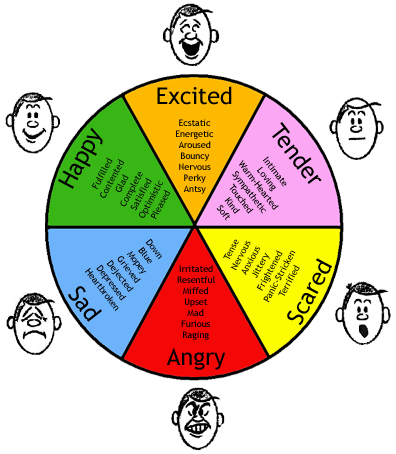

	  
	<h3>Emotions Detection from text using Deep Learning</h3>

### Usage
Use `experiment.py` in `src/` directory to perform the experiment

### Documents

+ [Requirement gathering](docs/requirements.md)
+ [Project analysis](docs/project_analysis.md)

