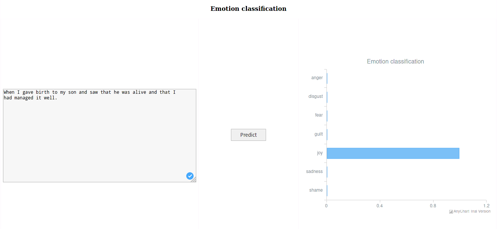

<div align="center">
	 <br>
	<h3>Emotions Detection from text using Deep Learning</h3>
</div>


### Usage
Use `experiment.py` in `src/` directory to perform the experiment

Usage: `python experiment.py --help`

### Experiments
```
usage: experiment.py [-h] [-l LOG_LEVEL] [-t TEST_SIZE] [-k KERNEL] [-d DEGREE] [-c COST] [-g GAMMA] [-s SAVE_MODEL] [--data-augmentation DATA_AUGMENTATION]
                     [--augment-size AUGMENT_SIZE]
                     model

positional arguments:
  model                 select model from (naive, svm, logistic)

optional arguments:
  -h, --help            show this help message and exit
  -l LOG_LEVEL, --log-level LOG_LEVEL
                        Select log level from (debug, info, warning, error, critical)
  -t TEST_SIZE, --test-size TEST_SIZE
                        Proportion of dataset to use as test set
  -k KERNEL, --kernel KERNEL
                        Kernel name for svm
  -d DEGREE, --degree DEGREE
                        Degree of polynomial kernel
  -c COST, --cost COST  Cost parameter for svm
  -g GAMMA, --gamma GAMMA
                        Kernel coefficient for rbf, poly and sigmoid kernel
  -s SAVE_MODEL, --save-model SAVE_MODEL
                        Save model to filename
  --data-augmentation DATA_AUGMENTATION
                        Data augmentation type from wordnet, bert, ...
  --augment-size AUGMENT_SIZE
                        Propertion of data to augment. Default to 0.2 of one-fifth.
```

### API

RUN `python run_flask.py`


### Frontend and output

<div align="center">
	
</div>

### Documents

+ [Requirement gathering](docs/requirements.md)
+ [Project analysis](docs/project_analysis.md)

